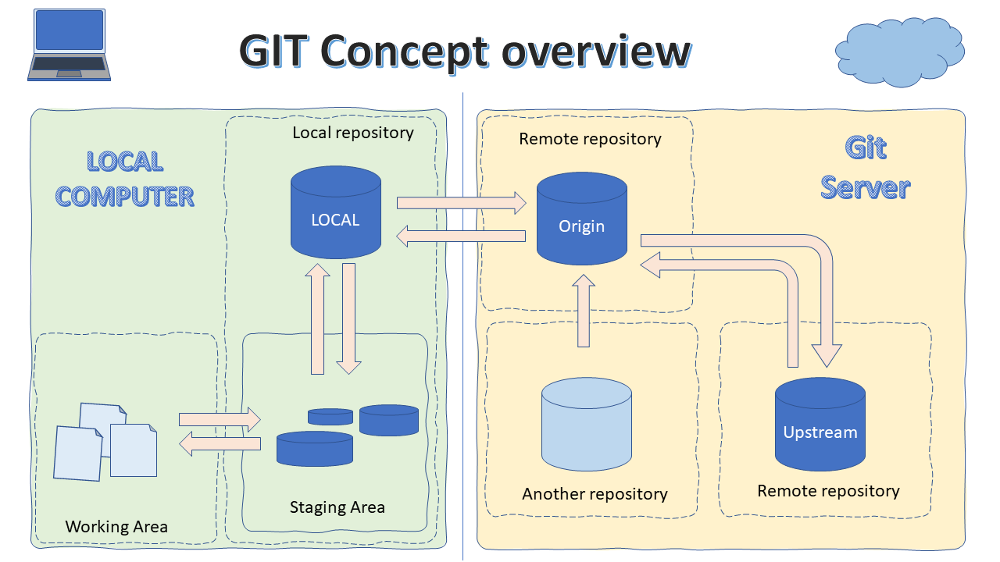
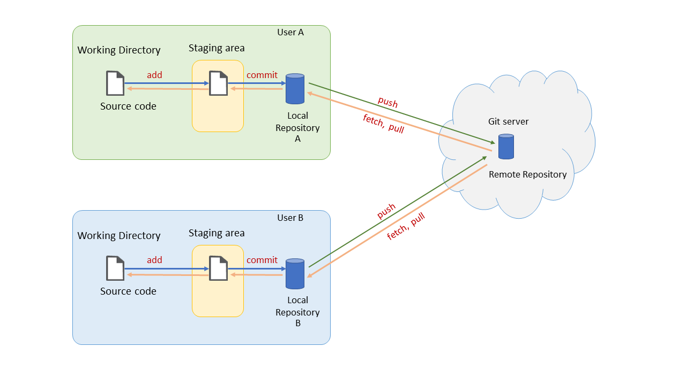
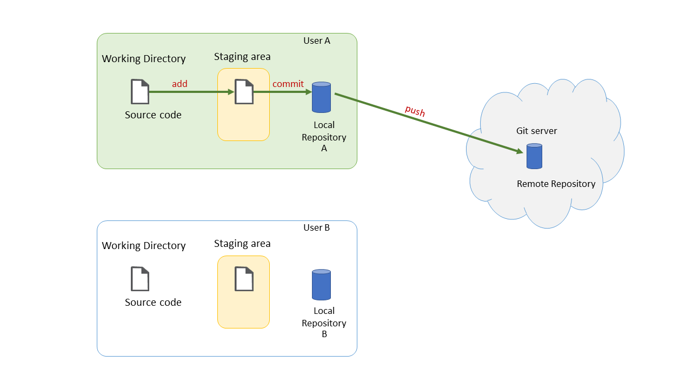
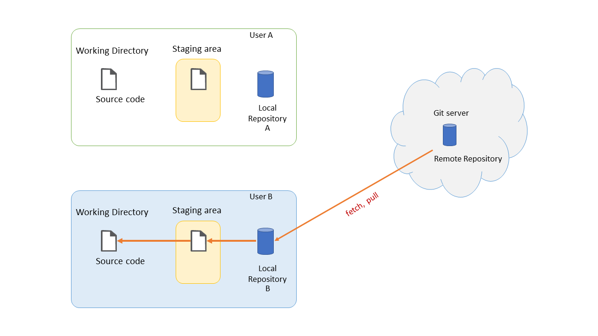
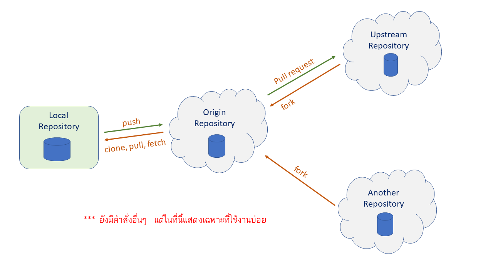

# git-introduction

git เป็น software ควบคุม version ที่มีการเก็บรักษา source code รวมทั้งไฟล์ต่าง ๆ ไว้ในเครื่องคอมพิวเตอร์ของผู้ใช้และบน server ได้พร้อมๆ กัน โดยจะเรียกพื้นที่เก็บไฟล์ว่า  'repository' 

ในขณะที่กำลังพัฒนาโปรแกรมหรือแก้ไขเอกสารต่างๆ เราสามารถใช้ git เป็นตัวช่วยการติดตามการเปลี่ยนแปลง (tracking) และรวมส่วนต่างๆ ของโปรแกรมหรือเอกสารเข้าด้วยกัน (merging) จนกระทั่งได้โปรแกรมหรือเอกสารที่สมบูรณ์ และหากมีข้อผิดพลาดโดยไม่ตั้งใจ เราสามารถใช้ git เพื่อเปรียบเทียบความแตกต่างระหว่างการแก้ไขในแต่ละรุ่น นอกจากนี้ git ยังมีความสามารถอีกมากมายซึ่งจะได้กล่าวถึงในลำดับถัดไป

ผู้ใช้ที่มีสิทธิ์เข้าถึง repository สามารถช่วยกันพัฒนาโปรแกรมหรือช่วยกันแก้ไขเอกสารได้ โดยสามารถแก้ไขงานได้ที่เครื่องของตนเอง (local) และสามารถ upload การเปลี่ยนแปลงใดๆ ขึ้นไปเก็บบน server ได้ตามต้องการ

ภาพรวมในการทำงานของ git ทั้งฝั่ง local และ server แสดงได้ดังรูปที่ 1

__รูปที่ 1__

จากรูปที่ 1 ถ้าแบ่งตามลักษณะของคอมพิวเตอร์ที่ใช้ในการพัฒนาโปรแกรม เราสามารถแบ่งออกได้เป็น 2 ฝั่งได้แก่ ฝั่ง local repository (หรือ Local Computer)  และ remote repository (หรือ Git Server)

### ฝั่ง Local repository ###

เมื่อผู้ใช้สร้าง local repository ขึ้นใน folder ที่กำลังแก้ไข source code นั้น โปรแกรม  git ก็จะสร้างโฟลเดอร์ที่มี attribute เป็น hidden โดยตั้งชื่อว่า .git 
ทำหน้าที่เป็น local repository เพื่อเอาไว้เก็บการติดตามการเปลี่ยนแปลงและ sync กับ remote repository บน server

หากเราต้องการจะเข้าไปดูไฟล์ต่าง ๆ ในโฟลเดอร์ .git เราต้องกำหนดตัวเลือกแสดง Hidden Items ของ file browser (1) ก็จะทำให้มองเห็นโฟลเดอร์หรือไฟล์ที่ซ่อนอยู่ (2)

__รูปที่ 2__  การกำหนดตัวเลือกของ file browser ให้มองเห็นโฟลเดอร์ .git

#### ภายในโฟลเดอร์ .git ####
ภายในโฟลเดอร์ .git (local repository) จะมีองค์ประกอบสองอย่างคือ 

1. __Local database__ 
 
Local database ทำหน้าที่เก็บเนื้อหาเริ่มต้นและการเปลี่ยนแปลงเนื้อหาของไฟล์ ซึ่งใน database จะเก็บเฉพาะส่วนที่มีการเปลี่ยนแปลงนับจากการบันทึกไฟล์ครั้งก่อนหน้าเท่านั้น จะไม่มีการเก็บเนื้อหาทั้งไฟล์ของแต่ละรุ่น ทำให้ประหยัดพื้นที่ใน database ซึ่งการเปลี่ยนแปลงเนื้อหานี้อาจจะเป็นการเพิ่มหรือลบก็ได้ โดย git จะทำการเปรียบเทียบบรรทัดต่อบรรทัด 

ถ้าต้องการเรียกดูว่าเนื้อหาจริงๆ ของไฟล์นั้นๆ คืออะไร ก็ต้องเริ่มจากรุ่นแรกสุดของไฟล์นั้น แล้วดำเนินการติดตามจากการเปลี่ยนแปลงทีละขั้นที่บันทึกไว้ใน database จนถึงจุดที่เรียกดูข้อมูลในไฟล์นั้น ๆ 
 
 ตัวอย่าง เช่น ไฟล์ source code ไฟล์หนึ่งมีการแก้ไขทั้งหมด 10 ครั้ง ถ้าต้องการดูเนื้อหาที่เกิดจากการแก้ไขครั้งที่ 7 ก็ต้องนำเนื้อหาตั้งแต่เริ่มต้น (initial) นำมาปรับปรุงตามการแก้ไขแต่ละครั้ง (เพิ่มหรือลบเนื้อหา ตามหมายเลขบรรทัดที่ระบุไว้ใน database) จนถึงครั้งที่ 7 ก็จะได้เนื้อหาของการแก้ครั้งที่ 7 ออกมา ถ้าทำข้ามขั้นหรือไม่ครบตามขั้นตอนที่ระบุใน database ก็จะได้เนื้อหาที่ผิดพลาดออกมา 

 2. __Staging area__ 
 
Staging area เป็นพื้นที่เก็บเนื้อหาที่จะนำไปบันทึกใน local database เนื้อหาในส่วนนี้จะไม่ได้เก็บไฟล์ source code ที่สมบูรณ์ของรุ่นนั้น ๆ จะระบุเพียงแค่ความแตกต่างระหว่างรุ่นของไฟล์ต่างๆ เท่านั้น เช่นมีการแก้ไข (เพิ่มหรือลบ) บรรทัดใดบ้าง แก้ไขเนื้อหาจากอะไรเป็นอะไร เป็นต้น

__รูปที่ 3__ ตัวอย่างไฟล์และโฟลเดอร์ใน .git 

#### ภายในโฟลเดอร์ทำงาน  ####

ในโฟลเดอร์ทำงาน (Working Area) จะมีโฟลเดอร์ .git ตั้งอยู่ด้วย แต่จะถูกซ่อนจากผู้ใช้ (Hidden attribute) โฟลเดอร์ทำงานใช้เป็นที่เก็บ source code หรือเอกสารที่ต้องการให้ git ติดตามการเปลี่ยนแปลง 
ไฟล์ทั้งหมดที่ถูกสั่งให้มีการติดตามโดย git จะถูกนำไปเปรียบเทียบกับไฟล์ที่อยู่ใน database ในทันทีที่ได้รับการบันทึกลงใน harddisk ผลต่างที่ได้สามารถส่งไปยังพื้นที่ staging area และ database ได้โดยการ commit  

เราสามารถกำหนดได้ว่าจะให้ git ติดตามการเปลี่ยนแปลงของเอกสารใดบ้าง (ได้ทั้งระดับโฟลเดอร์หรือระดับไฟล์) โดยสามารถกำหนด spec ของโฟลเดอร์หรือไฟล์ไว้ในเอกสารที่ชื่อว่า .gitignore หรือ .gitinclude

__รูปที่ 4__ ตัวอย่างไฟล์และโฟลเดอร์ใน working directory

### ฝั่ง remote (git Server) ###

รูปที่ 2

รูปที่ 3

รูปที่ 4

รูปที่ 5
 
